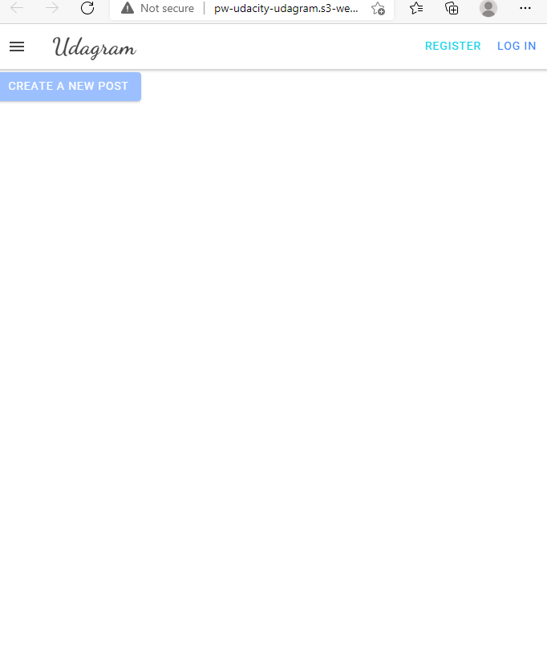

# Udagram

This application is provided to you as an alternative starter project if you do not wish to host your own code done in the previous courses of this nanodegree. The udagram application is a fairly simple application that includes all the major components of a Full-Stack web application.

## Getting Started

1. Clone this repo locally into the location of your choice.
1. Move the content of the udagram folder at the root of the repository as this will become the main content of the project.
1. Open a terminal and navigate to the root of the repo
1. follow the instructions in the installation step

The project can run but is missing some information to connect to the database and storage service. These will be setup during the course of the project

### Dependencies

```
- Node v14.15.1 (LTS) or more recent. While older versions can work it is advisable to keep node to latest LTS version

- npm 6.14.8 (LTS) or more recent, Yarn can work but was not tested for this project

- AWS CLI v2, v1 can work but was not tested for this project

- A RDS database running Postgres.

- A S3 bucket for hosting uploaded pictures.

```

### Installation

Provision the necessary AWS services needed for running the application:

1. In AWS, provision a publicly available RDS database running Postgres. <Place holder for link to classroom article>
1. In AWS, provision a s3 bucket for hosting the uploaded files. <Place holder for tlink to classroom article>
1. Export the ENV variables needed or use a package like [dotnev](https://www.npmjs.com/package/dotenv)/.
1. From the root of the repo, navigate udagram-api folder `cd starter/udagram-api` to install the node_modules `npm install`. After installation is done start the api in dev mode with `npm run dev`.
1. Without closing the terminal in step 1, navigate to the udagram-frontend `cd starter/udagram-frontend` to intall the node_modules `npm install`. After installation is done start the api in dev mode with `npm run start`.

## Testing

This project contains two different test suite: unit tests and End-To-End tests(e2e). Follow these steps to run the tests.

1. `cd starter/udagram-frontend`
1. `npm run test`
1. `npm run e2e`

There are no Unit test on the back-end

### Unit Tests:

Unit tests are using the Jasmine Framework.

### End to End Tests:

The e2e tests are using Protractor and Jasmine.

## Built With

- [Angular](https://angular.io/) - Single Page Application Framework
- [Node](https://nodejs.org) - Javascript Runtime
- [Express](https://expressjs.com/) - Javascript API Framework

## License

[License](LICENSE.txt)


# Udagram Project
This is a cloud application developed alongside the Full Stack JavaScript Developer program at Udacity. Most code developed by Udacity.  It allows us to learn how to set up deployment using AWS (RDS, EB, S3).  The application allows users to register and log into a web client and post photos to the feed.



## Table of Contents
* [General Info](#general-information)
* [Technologies](#technologies)
* [Install dependencies](#install-dependencies)
* [Start Server API](#start-server-api)
* [Start FrontEnd](#start-frontend)
* [CircleCI Status Badges](#circleci-status-badges)
* [Purpose of this project](#purpose-of-this-project)
* [Contact](#contact)

## General Information
Patrick would gain his experience deploying the Udagram app that developed by Udacity while learning the following different things:
- AWS Console including RDS, EB, S3
- AWS CLI S3
- CircleCI
- Set up on local first to see if it works okay before deploying it to AWS

The Udagram app was developed in two separate parts which are:
- Backend API: Node and Express
- Frontend: Angular and Ionic

## Technologies 
- AWS
- CircleCI
- NPM
- Node.js

## Install dependencies
Clone this repository and open your terminal and go to the root of the directory of this project.
Then execute the following at your command or terminal:
```
cd udagram-api
npm install
```
```
cd ..
cd udagram-frontend
npm install
```

## Start server
Open your terminal and go to the root of the directory of this project.
Then run the following at your command or terminal:
```
cd udagram-api
npm run dev
```
Open new terminal while keeping the other terminal open so API can stay running.
Go to the root of the directory of this project.
Then run the following at your commandd or terminal:
```
cd udagram-frontend
npm run start
```

It will run the web application at http://localhost:4200.  Please go to the browser and type it in the address. It should show as the screenshot above.

## CircleCI 
- Process:
    - config.yml would do the following in the order:
        - Front-End Install: It will update the dependencies of the Front-End
        - Back-End Install: It will update the dependencies of the back-end
        - Front-End Build: It will build the code and produce javascript files into folder called WWW.
        - Back-End Build: It will build the code and produce javascript files into the folder called WWW.
        - Front-End Deploy: It will deploy the WWW code into S3 as a website hosting.
        

- Status Badge
    - [](<LINK>)

## Purpose of this project
This is one of the Full Stack JavaScript Developer's project for Udacity.  It gives Patrick an opportunity to gain experience and knowledge of the deployment including AWS such as EB, RDS, S3, and CircleCI.

## Contact
Created by [Patrick Wallin](https://www.linkedin.com/in/patrick-wallin) - feel free to contact me!
