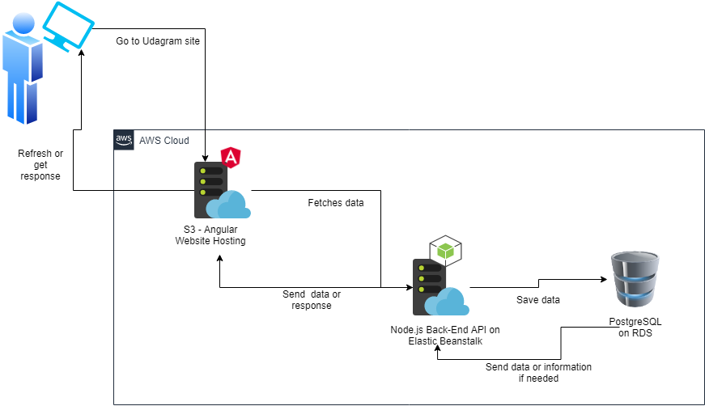

# Infrastructure

## Cloud System - AWS

We use AWS as a cloud service for the following:
- Relational Database Service (RDS)
    - PostgreSQL Database
- Elastic Beanstalk (EB)
    - Back-End API Hosting
- Simple Storage Service (S3)
    - Front-End Angular/Ionic Hosting

## Schema

