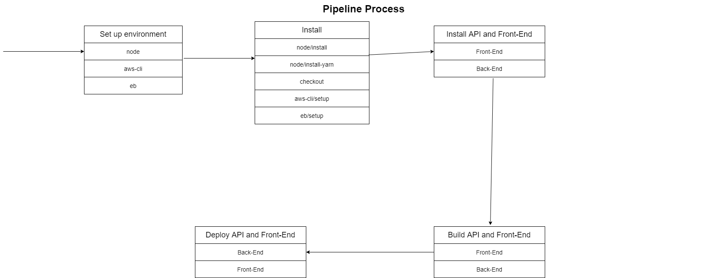

# Pipeline Process

We use CircleCI for automatically development process to install necessary tools and launch some code and set up on AWS.

## Configuration For CircleCI

1. At the beginning, we request CircleCI to import the following: node, aws-cli, and eb which is under 'Orbs' on config.yml file.
2. Then we install them and checkout.  See below which is in config.yml file:
    - node/install
    - node/install-yarn
    - checkout
    - aws-cli/setup
    - eb/setup
3. Then we would install, build, and deploy on both parts: frontend and backend.  The following is in order so it would run smoothly.
    - FrontEnd Install
    - BackEnd Install
    - FrontEnd Build
    - BackEnd Build
    - BackEnd Deploy (need to be this first before FrontEnd Deploy since FrontEnd is depending on API)
    - FrontEnd Deploy

## Schema

